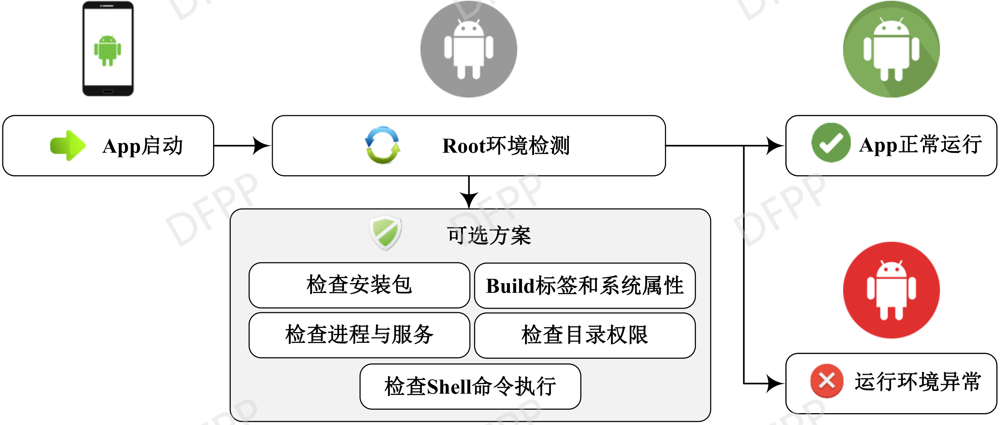
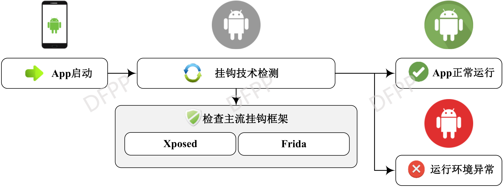

# 反动态分析技术代码示例

反动态分析技术是在软件开发和保护领域应用日益增长的一个关键方面，其目的是在程序运行时防止或干扰恶意用户对软件的分析和篡改。与反静态分析技术主要针对软件代码的静态属性进行保护不同，反动态分析技术专注于运行时环境和行为，提供了一种更为动态和适应性强的保护策略。

动态分析允许分析者在程序执行过程中检查其状态和行为，这种方法非常适合于揭示软件中的运行时问题和漏洞。然而，这也给恶意分析带来了机会，他们可以利用动态分析工具如调试器、代码注入工具和运行时监控软件来探测和利用程序的弱点。为了对抗这种分析，反动态分析技术应运而生，它通过各种手段阻止或误导动态分析过程，以保护软件的运行安全。

在本项目中，我们展示了五大类主流的反动态分析技术。除了文中论述的反调试、虚拟环境检测和Root检测技术外，本项目还涵盖了反Hook和反篡改两类技术。我们提供了这五大类反动态分析技术详尽的代码示例和说明。通过对这些经典技术的展示，我们旨在帮助读者深入理解反动态分析技术。

## 反调试技术
安卓反调试技术是指在安卓应用中实施各种策略和方法以检测和防止调试器附加和分析，从而保护应用程序代码和数据免受逆向工程和攻击。下图展示了基本的反调试技术利用流程及其可选方案。

简单反调试技术因其简单有效的特点得到了广泛的使用，在本项目中，我们展示了文中提到的三种简单反调试技术的具体代码实现细节，详情如下：
```c
#include <jni.h>
#include <unistd.h>
#include <signal.h>
#include <stdio.h>
#include <string.h>
#include <stdlib.h>
#include <time.h>

// 时间检测方法
void check_execution_time() {
    struct timespec start, end; // 用于记录时间
    long elapsed_time;

    // 获取当前时间（开始时间）
    clock_gettime(CLOCK_MONOTONIC, &start);

    // 执行一段计算任务
    volatile int result = 0;
    for (int i = 0; i < 1000000; i++) {
        result += i; // 模拟计算
    }

    // 获取当前时间（结束时间）
    clock_gettime(CLOCK_MONOTONIC, &end);

    // 计算执行时间（纳秒）
    elapsed_time = (end.tv_sec - start.tv_sec) * 1000000000L + (end.tv_nsec - start.tv_nsec);

    // 如果执行时间超过预设阈值，说明可能存在调试器干预
    if (elapsed_time > 5000000L) { // 预设阈值为 5 毫秒（5000000 纳秒）
        kill(getpid(), SIGKILL); // 结束当前进程
    }
}

// TracerPid 检测
void check_tracer_pid() {
    int buffsize = 1024;
    char filename[buffsize];   // 用于保存文件路径
    char line[buffsize];       // 读取文件的每一行
    int pid = getpid();        // 获取当前进程 ID

    sprintf(filename, "/proc/%d/status", pid); // 拼接 /proc/<pid>/status 文件路径
    FILE *fp = fopen(filename, "r");
    if (fp != NULL) {
        while (fgets(line, buffsize, fp)) {
            // 检测文件中的 "TracerPid" 字段
            if (strncmp(line, "TracerPid", 9) == 0) {
                int status = atoi(&line[10]); // 提取 TracerPid 的值
                if (status != 0) {
                    fclose(fp);
                    kill(pid, SIGKILL); // 如果 TracerPid 不为 0，结束进程
                }
                break;
            }
        }
        fclose(fp);
    }
}

// 进程名检测
void check_process_name() {
    int buffsize = 1024;
    char filename[buffsize];   // 用于保存 /proc/<pid>/status 路径
    char line[buffsize];       // 用于读取文件每一行
    char name[buffsize];       // 用于保存可疑进程名文件路径
    char nameline[buffsize];   // 用于读取可疑进程名

    int pid = getpid();        // 获取当前进程 ID
    sprintf(filename, "/proc/%d/status", pid); // 拼接 /proc/<pid>/status 文件路径
    FILE *fp = fopen(filename, "r");
    if (fp != NULL) {
        while (fgets(line, buffsize, fp)) {
            // 检测 "TracerPid" 字段
            if (strstr(line, "TracerPid") != NULL) {
                int status = atoi(&line[10]); // 提取 TracerPid 的值
                if (status != 0) {
                    // 如果 TracerPid 不为 0，检查其 cmdline 是否包含特定调试器进程名
                    sprintf(name, "/proc/%d/cmdline", status);
                    FILE *fpname = fopen(name, "r");
                    if (fpname != NULL) {
                        while (fgets(nameline, buffsize, fpname) != NULL) {
                            // 检测是否包含 "android_server" 等可疑进程名
                            if (strstr(nameline, "android_server") != NULL) {
                                fclose(fpname);
                                kill(pid, SIGKILL); // 如果找到可疑进程名，结束当前进程
                            }
                        }
                        fclose(fpname);
                    }
                }
                break;
            }
        }
        fclose(fp);
    }
}

// JNI_OnLoad 方法：在加载 JNI 时执行检测
jint JNI_OnLoad(JavaVM* vm, void* reserved) {
    check_execution_time();  // 时间检测
    check_tracer_pid();      // 检测 TracerPid
    check_process_name();    // 检测可疑进程名
    return JNI_VERSION_1_6;  // 返回 JNI 版本
}
```

## 虚拟环境检测技术
虚拟环境检测技术是指通过各种手段识别和判断软件运行环境是否为虚拟机，以避免安全威胁和数据泄露等问题。下图展示了基本的虚拟环境检测技术利用流程及其可选方案。

对于虚拟环检测技术，在实际应用时，往往是多种不同的方法共同使用，以保证检测结果的可靠性，具体的代码可以参考如下：
```java
@Deprecated
public boolean readSysProperty() {
    
    return readSysProperty(null, null);
}

public boolean readSysProperty(Context context, EmulatorCheckCallback callback) {
    // 接收上下文和回调接口，用于检测模拟器环境
    this.emulatorCheckCallback = callback;
    int suspectCount = 0; // 用于记录可疑模拟器特征的计数

    // 检测基带信息是否为空或为模拟器的默认值
    String baseBandVersion = getProperty("gsm.version.baseband");
    if (null == baseBandVersion || baseBandVersion.contains("1.0.0.0")) 
        ++suspectCount; // 模拟器通常没有真实的基带信息

    // 检测系统构建版本信息（ro.build.flavor）是否为模拟器特征值
    String buildFlavor = getProperty("ro.build.flavor");
    if (null == buildFlavor || buildFlavor.contains("vbox") || buildFlavor.contains("sdk_gphone"))
        ++suspectCount; // "vbox" 和 "sdk_gphone" 是常见模拟器的标识

    // 检测产品板信息（ro.product.board）是否为空或包含模拟器标识
    String productBoard = getProperty("ro.product.board");
    if (null == productBoard || productBoard.contains("android") | productBoard.contains("goldfish"))
        ++suspectCount; // "android" 和 "goldfish" 是模拟器芯片的常见标识

    // 检测芯片平台信息（ro.board.platform）是否为空或包含模拟器标识
    String boardPlatform = getProperty("ro.board.platform");
    if (null == boardPlatform || boardPlatform.contains("android"))
        ++suspectCount; // 模拟器平台通常包含 "android"

    // 检测硬件信息（ro.hardware），以及是否为特定模拟器的特征标识
    String hardWare = getProperty("ro.hardware");
    if (null == hardWare) 
        ++suspectCount; // 如果硬件信息为空，增加可疑计数
    else if (hardWare.toLowerCase().contains("ttvm")) 
        suspectCount += 10; // 天天模拟器特征，增加权重计数
    else if (hardWare.toLowerCase().contains("nox")) 
        suspectCount += 10; // 夜神模拟器特征，增加权重计数

    // 以下部分需要上下文 context 的支持
    String cameraFlash = ""; // 用于记录设备是否支持闪光灯
    String sensorNum = "sensorNum";
    if (context != null) {
        // 检测设备是否支持闪光灯
        boolean isSupportCameraFlash = context.getPackageManager().hasSystemFeature("android.hardware.camera.flash");
        if (!isSupportCameraFlash) ++suspectCount; // 模拟器通常不支持闪光灯
        cameraFlash = isSupportCameraFlash ? "support CameraFlash" : "unsupport CameraFlash";

        // 检测设备上的传感器数量，模拟器通常传感器较少
        SensorManager sm = (SensorManager) context.getSystemService(Context.SENSOR_SERVICE);
        int sensorSize = sm.getSensorList(Sensor.TYPE_ALL).size();
        if (sensorSize < 7) ++suspectCount; // 如果传感器少于 7 个，增加可疑计数
        sensorNum = sensorNum + sensorSize;
    }

    if (emulatorCheckCallback != null) {
        StringBuffer stringBuffer = new StringBuffer("ceshi start|")
                .append(baseBandVersion).append("|") // 基带信息
                .append(buildFlavor).append("|")    // 系统版本信息
                .append(productBoard).append("|")  // 产品板信息
                .append(boardPlatform).append("|") // 芯片平台
                .append(hardWare).append("|")      // 硬件信息
                .append(cameraFlash).append("|")   // 闪光灯支持
                .append(sensorNum).append("|");     // 传感器数量
                
        emulatorCheckCallback.findEmulator(stringBuffer.toString());
        emulatorCheckCallback = null; 
    }

    // 如果可疑计数超过 3，认为当前环境为模拟器
    return suspectCount > 3;
}
```

## Root检测技术
Root检测技术是用于识别设备是否经过Root权限获取，以保护应用程序免受未经授权的修改和潜在的安全威胁。下图展示了基本的Root检测技术利用流程及其可选方案。

在本项目中，我们展示了通过检查ro.secure属性和检测su文件来判断设备是否被Root的代码实现细节。
```java
public boolean isRoot() {
    // 检测设备是否被 Root
    int secureProp = getroSecureProp(); // 检查 ro.secure 属性的值
    if (secureProp == 0) // 如果 ro.secure 为 0，则设备为 eng 或 userdebug 版本，默认带有 root 权限
        return true;
    else
        return isSUExist(); // 如果是 user 版本，进一步检查是否存在 su 文件
}

private int getroSecureProp() {
    int secureProp;
    // 获取 ro.secure 属性的值，ro.secure 是 Android 系统用于标识安全性的属性
    String roSecureObj = CommandUtil.getSingleInstance().getProperty("ro.secure");
    if (roSecureObj == null) 
        secureProp = 1; // 如果属性不存在，默认为安全（1）
    else {
        if ("0".equals(roSecureObj)) 
            secureProp = 0; // 如果属性值为 "0"，表示设备为 eng 或 userdebug 版本
        else 
            secureProp = 1; // 否则，默认为安全（1）
    }
    return secureProp; // 返回 ro.secure 的值（0 表示不安全，1 表示安全）
}

private boolean isSUExist() {
    // 检查设备上是否存在 su 文件，su 文件是 Root 权限的常见标志
    File file = null;
    // 常见的 su 文件路径列表
    String[] paths = {"/sbin/su",
            "/system/bin/su",
            "/system/xbin/su",
            "/data/local/xbin/su",
            "/data/local/bin/su",
            "/system/sd/xbin/su",
            "/system/bin/failsafe/su",
            "/data/local/su"};
    for (String path : paths) {
        file = new File(path); // 创建 File 对象检查路径
        if (file.exists()) 
            return true; // 如果找到 su 文件，返回 true
        // 进一步可以添加对文件的可执行性检测，增强判断准确性
    }
    return false; // 如果所有路径均未找到 su 文件，返回 false
}

```


## 反Hook技术
下图展示了基本的反Hook技术利用流程及其可选方案。

在反Hook技术中，最常用的方法就是直接判断Hook框架对应的包是否存在。在本项目中，我们给出XPosed框架的检测代码。
```java
// 定义 Xposed 框架的关键类，用于检测是否存在 Xposed 环境
private static final String XPOSED_HELPERS = "de.robv.android.xposed.XposedHelpers";
private static final String XPOSED_BRIDGE = "de.robv.android.xposed.XposedBridge";

// 通过抛出异常检查堆栈信息，判断 Xposed 环境是否存在
public boolean isEposedExistByThrow() {
    try {
        // 手动抛出异常，捕获异常堆栈信息
        throw new Exception("gg");
    } catch (Exception e) {
        // 遍历异常堆栈中的每一项，检查是否包含 Xposed 框架的类名
        for (StackTraceElement stackTraceElement : e.getStackTrace()) {
            if (stackTraceElement.getClassName().contains(XPOSED_BRIDGE)) 
                return true; // 如果堆栈中包含 Xposed 框架的类名，说明 Xposed 环境存在
        }
        return false; // 堆栈中未发现 Xposed 框架的类名，说明 Xposed 环境不存在
    }
}

// 检查 Xposed 的关键类是否存在，判断是否有 Xposed 环境
public boolean isXposedExists() {
    try {
        // 尝试加载 XposedHelpers 类，如果成功加载，说明存在 Xposed 环境
        Object xpHelperObj = ClassLoader
                .getSystemClassLoader()
                .loadClass(XPOSED_HELPERS)
                .newInstance();
    } catch (InstantiationException e) {
        e.printStackTrace();
        return true; // 报异常，说明 XposedHelpers 类可能存在
    } catch (IllegalAccessException e) {
        e.printStackTrace();
        return true; // 报异常，说明 XposedHelpers 类可能存在
    } catch (ClassNotFoundException e) {
        e.printStackTrace();
        return false; // 未找到类，说明 XposedHelpers 不存在
    }

    try {
        // 尝试加载 XposedBridge 类，如果成功加载，说明存在 Xposed 环境
        Object xpBridgeObj = ClassLoader
                .getSystemClassLoader()
                .loadClass(XPOSED_BRIDGE)
                .newInstance();
    } catch (InstantiationException e) {
        e.printStackTrace();
        return true; // 报异常，说明 XposedBridge 类可能存在
    } catch (IllegalAccessException e) {
        e.printStackTrace();
        return true; // 报异常，说明 XposedBridge 类可能存在
    } catch (ClassNotFoundException e) {
        e.printStackTrace();
        return false; // 未找到类，说明 XposedBridge 不存在
    }
    return true; // 如果两个类都加载成功，说明 Xposed 环境存在
}

// 尝试关闭 Xposed 的全局开关
public boolean tryShutdownXposed() {
    // 首先通过异常堆栈检查是否存在 Xposed 环境
    if (isEposedExistByThrow()) {
        Field xpdisabledHooks = null;
        try {
            // 尝试通过反射加载 XposedBridge 类，并获取 disableHooks 字段
            xpdisabledHooks = ClassLoader.getSystemClassLoader()
                    .loadClass(XPOSED_BRIDGE)
                    .getDeclaredField("disableHooks");
            xpdisabledHooks.setAccessible(true); // 设置字段为可访问
            xpdisabledHooks.set(null, Boolean.TRUE); // 将 disableHooks 设置为 true，关闭全局钩子
            return true; // 成功关闭 Xposed 钩子
        } catch (NoSuchFieldException e) {
            e.printStackTrace();
            return false; // 未找到 disableHooks 字段，关闭失败
        } catch (ClassNotFoundException e) {
            e.printStackTrace();
            return false; // 未找到 XposedBridge 类，关闭失败
        } catch (IllegalAccessException e) {
            e.printStackTrace();
            return false; // 无法访问字段，关闭失败
        }
    } else {
        return true; // 如果未检测到 Xposed 环境，直接返回 true
    }
}

```
## 反篡改技术
安卓反篡改技术是一种用于保护应用程序完整性的方法，通过检测和防止未经授权的修改来确保程序运行的安全性和可靠性。下图展示了基本的反篡改技术利用流程及其可选方案。

利用 V2 及以上签名认证或者检测应用是否从可信来源（如 Google Play 商店）安装，是常用且简单的手段。在本项目中，我们展示了这两种反篡改方法的代码实现细节。
```java
import android.content.Context;

public class AntiTamper {

    /**
     * 检测应用是否被篡改
     *
     * @param context 应用上下文
     */
    public static void checkIntegrity(Context context) {
        // 检查签名是否有效
        if (!SignatureVerifier.isSignatureValid(context)) {
            throw new SecurityException("Application signature mismatch! Possible tampering detected.");
        }

        // 检查安装来源是否可信
        if (!InstallerVerifier.isInstallerTrusted(context)) {
            throw new SecurityException("Application was installed from an untrusted source!");
        }

        // 如果两项检查均通过，应用未被篡改
        System.out.println("Application integrity check passed.");
    }
}
```
